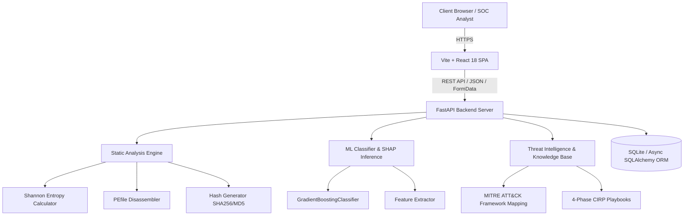

# 🛡️ MalGuard — AI-Driven Cyber Defense SOC & Threat Intelligence Platform

[](https://mal-guard.vercel.app/)
[](https://fastapi.tiangolo.com)
[](https://react.dev)
[](https://vitejs.dev)
[](https://python.org)
[](https://attack.mitre.org/)

**MalGuard** is an open-source, enterprise-grade Security Operations Center (SOC) dashboard and malware triage engine. It combines deterministic static binary analysis (PE disassembly, Shannon entropy, packer detection, Win32 API categorization) with machine learning inference and SHAP explainability to classify threats, map adversary tradecraft to the MITRE ATT&CK framework, and generate actionable Computer Incident Response Planning (CIRP) playbooks.

---

## 🌟 Core Modules

### 1. 📊 Security Operations Center (SOC) Overview
- Real-time telemetry monitoring flagged threats, clean binaries, and quarantined samples.
- High-level posture metrics with priority indicators and live feed stats.
- Integrated quick action triggers for rapid triage and sandbox testing.

### 2. 🔬 Deep File Threat Analyzer
- **Static PE Disassembly**: Extracts section headers (`.text`, `.data`, `.rsrc`), import directory tables, and suspicious symbols.
- **Shannon Entropy Calculation**: Computes byte-level entropy ($0.0 - 8.0$) across file segments to uncover packed, encrypted, or obfuscated payloads (UPX, ASPack, etc.).
- **Win32 API Behavioral Categorization**: Maps API imports to attack vectors:
  - *Process Injection*: `VirtualAllocEx`, `CreateRemoteThread`, `WriteProcessMemory`
  - *Ransomware Indicators*: `CryptEncrypt`, `CryptGenKey`, `CryptAcquireContext`
  - *Defense Evasion*: `IsDebuggerPresent`, `CheckRemoteDebuggerPresent`
  - *Persistence*: `RegSetValueExA`, `CreateServiceA`
- **Machine Learning Classification**: Trained Gradient Boosting classifier providing multi-class prediction (Ransomware, Trojan, Spyware, Worm, Benign).
- **Explainable AI (XAI)**: Feature attribution scores showing which indicators drove the risk assessment.
- **MITRE ATT&CK Tagging**: Direct correlation of observed capabilities to MITRE tactics and techniques.

### 3. 📋 Forensic Scan Audit History
- Chronological audit ledger recording hashes (`SHA-256`, `MD5`, `SHA-1`), file formats, timestamps, and verdicts (`MALICIOUS`, `SUSPICIOUS`, `BENIGN`).
- Filter by threat severity, search by file name or hash, and review complete forensic reports in-modal.

### 4. 📚 Malware Family Encyclopedia
- Deep reference repository for major threat classes:
  - **Ransomware** (Crypto-lockers, extortion payloads)
  - **Trojan** (Remote Access Trojans, backdoors)
  - **Spyware** (Keyloggers, credential harvesters)
  - **Worm** (Self-propagating network infections)
  - **Adware** (Aggressive browser hijackers)
- Interactive **4-Phase Incident Response Playbook** for each threat family:
  1. 🔴 **Phase 1: Containment** (Network isolation, token revocation, firewall rules)
  2. 🟡 **Phase 2: Eradication** (Payload purging, scheduled task removal, registry remediation)
  3. 🟢 **Phase 3: Recovery** (Clean backup restoration, validation, service re-enablement)
  4. 🔵 **Phase 4: Post-Incident & Prevention** (EDR rule tuning, patch management, threat hunting)

### 5. 🧪 Safe Sandbox Simulation
- Interactive testing sandbox to simulate adversarial tactics in a controlled environment without executing live malware binaries.
- Real-time demonstration of entropy fluctuations, simulated API hooking, and detection rule triggers.

---

## 🏗️ Architecture & Tech Stack



### Technology Highlights
| Component | Technologies Used |
|---|---|
| **Frontend** | React 18, Vite, Tailwind CSS, Lucide Icons, Modern Glassmorphism Design |
| **Backend API** | FastAPI, Python 3.11+, Pydantic v2, Uvicorn, Async SQLAlchemy |
| **Analysis & Heuristics** | `pefile`, `math` (Shannon entropy), `hashlib`, Custom API Signatures |
| **Machine Learning** | `scikit-learn` (Gradient Boosting), `joblib`, Feature Vectorizer |
| **Deployment** | Vercel (Frontend Client) + Render (Backend API Service) |

---

## 📁 Repository Structure

```
malguard/
├── backend/
│   ├── backend/
│   │   ├── api/routes/
│   │   │   ├── analyze.py          # File upload & static analysis route
│   │   │   ├── diagnose.py         # Malware taxonomy & family playbooks
│   │   │   └── health.py           # Heartbeat endpoint
│   │   ├── core/
│   │   │   ├── config.py           # App configuration & CORS policies
│   │   │   └── database.py         # Database engine & async sessionmaker
│   │   ├── services/
│   │   │   ├── static_analysis.py  # PE disassembly, hashes, entropy
│   │   │   ├── ml_classifier.py    # GBT model inference & feature scaling
│   │   │   └── knowledge_base.py   # MITRE ATT&CK matrix & playbooks
│   │   └── schemas/
│   │       └── schemas.py          # Pydantic validation schemas
│   ├── ml_models/
│   │   ├── artifacts/              # Serialized .joblib model files
│   │   └── training/train.py       # ML pipeline training script
│   ├── requirements.txt            # Python dependencies
│   └── Procfile                    # Render production process definition
├── frontend/
│   ├── src/
│   │   ├── components/
│   │   │   ├── dashboard/          # Stat cards, quick action banners, recent scans
│   │   │   ├── scanner/            # File dropzone, entropy gauge, PE tables
│   │   │   ├── encyclopedia/       # Threat family cards & playbook modal
│   │   │   └── layout/             # Sidebar, TopHeader, navigation
│   │   ├── pages/
│   │   │   ├── DashboardPage.jsx   # SOC Overview
│   │   │   ├── FileScannerPage.jsx # Threat Analyzer
│   │   │   ├── ScanHistoryPage.jsx # Forensic Audit Log
│   │   │   ├── MalwareEncyclopediaPage.jsx
│   │   │   └── SafeSimulationPage.jsx
│   │   ├── services/
│   │   │   └── api.js              # Axios HTTP client + fallback mocks
│   │   ├── App.jsx
│   │   └── index.css               # Clean Tailwind & design tokens
│   ├── package.json
│   └── vite.config.js
└── README.md                       # Platform documentation
```

---

## 🚀 Getting Started

### Prerequisites
- **Node.js**: v18.0.0 or higher
- **Python**: v3.11 or higher
- **Git**

---

### 1. Backend Setup

1. Navigate to the backend directory:
   ```bash
   cd backend
   ```

2. Create and activate a virtual environment:
   ```bash
   # Windows (PowerShell)
   python -m venv venv
   .\venv\Scripts\Activate.ps1

   # macOS / Linux
   python3 -m venv venv
   source venv/bin/activate
   ```

3. Install dependencies:
   ```bash
   pip install -r requirements.txt
   ```

4. *(Optional)* Train or regenerate the ML model:
   ```bash
   python ml_models/training/train.py
   ```

5. Start the FastAPI development server:
   ```bash
   uvicorn backend.main:app --reload --host 0.0.0.0 --port 8000
   ```
   Interactive Swagger documentation will be available at: `http://localhost:8000/docs`

---

### 2. Frontend Setup

1. Open a new terminal and navigate to the frontend directory:
   ```bash
   cd frontend
   ```

2. Install dependencies:
   ```bash
   npm install
   ```

3. Configure environment variables (if pointing to local backend):
   Create a `.env` file in `frontend/`:
   ```env
   VITE_API_URL=http://localhost:8000
   ```

4. Run the development server:
   ```bash
   npm run dev
   ```
   Open your browser at: `http://localhost:5173`

---

## 🔌 API Reference

### `POST /api/analyze`
Upload a binary or executable file for deep static decompilation, entropy computation, and heuristic scoring.

**Request:** `multipart/form-data` with `file=@sample.exe`

**Sample Response:**
```json
{
  "analysis_id": "8f3b28b7-8d02-46a4-9426-bf25a6691fa3",
  "filename": "sample.exe",
  "filesize_bytes": 1048576,
  "hashes": {
    "sha256": "4b9e28f09b578c772be482e9b0c265e31502dc8...",
    "md5": "70d287ef5a0de7926b4857640fa...",
    "sha1": "0172e27be4d63503a453f65e..."
  },
  "entropy": 7.84,
  "high_entropy": true,
  "is_pe": true,
  "packer_detected": true,
  "suspicious_import_categories": {
    "Process Injection": ["VirtualAllocEx", "WriteProcessMemory"],
    "Ransomware Indicators": ["CryptEncrypt", "CryptGenKey"]
  },
  "threat_indicators": [
    "High entropy detected (7.84) indicating packing or encryption",
    "Known packed section identified (.upx0)",
    "Import of process injection APIs"
  ],
  "ml_prediction": "Ransomware",
  "ml_confidence": 0.94,
  "verdict": "MALICIOUS",
  "mitre_tactics": ["Impact", "Defense Evasion", "Execution"]
}
```

### `GET /api/reports`
Retrieve a paginated list of recent scan audit records.

### `GET /api/reports/{analysis_id}`
Retrieve complete forensic details for a specific scan.

### `GET /api/families`
Fetch all threat family profiles with corresponding MITRE ATT&CK mappings and CIRP playbooks.

### `GET /api/health`
Healthcheck endpoint returning service status and database connectivity.

---

## 🛡️ MITRE ATT&CK Matrix Alignment

| Tactic | Technique ID | Technique Name | MalGuard Detection Vector |
|---|---|---|---|
| **Execution** | T1059 | Command and Scripting Interpreter | Process spawn API imports (`CreateProcessA`, `ShellExecuteA`) |
| **Defense Evasion** | T1027 | Obfuscated / Encrypted Files | Shannon Entropy > 7.0 & Packer signature parsing |
| **Defense Evasion** | T1055 | Process Injection | Memory allocation APIs (`VirtualAllocEx`, `WriteProcessMemory`) |
| **Discovery** | T1057 | Process Discovery | Toolhelp snapshot APIs (`CreateToolhelp32Snapshot`) |
| **Impact** | T1486 | Data Encrypted for Impact | Cryptographic provider APIs (`CryptEncrypt`, `CryptGenKey`) |

---

## 🔒 Security & Safe Handling Notice

> **IMPORTANT**: MalGuard parses binary files in a safe static analysis environment without execution. However, when handling real-world suspicious or potentially malicious binaries, always operate inside an air-gapped virtual machine or isolated sandbox. MalGuard does not perform dynamic kernel execution and is intended for defensive security engineering, education, and incident response planning.

---

## 📄 License
This project is licensed under the **MIT License**. See the `LICENSE` file for details.
